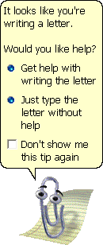

<!-- footer: '' -->

# New Grad Builders 🤖

**Session 1: Autonomous AI Agents — Running 24/7, For Free**

Kaleb Cole & Kevin Granados | March 2026

---

## Agenda

| Time | Section |
|------|---------|
| 0:00–5:00 | 🪝 **The Hook** — How I have autonomous AI agents running at all times, for free |
| 5:00–30:00 | 🔧 **The Setup** — Live walkthrough on a fresh VM together |
| 30:00–45:00 | 💬 **Discussion** — What should this community become? |

### Ground rules
- This is **not** a tutorial you watch — you will all do this
- Questions anytime — interrupt me
- Session is recorded for async viewers

---

## The Hook

### How I have autonomous AI agents running at all times, for free

- I have an AI agent on a VM that runs **24/7**
- It hunts for cars I want to buy (OpenClaw car project)
- It manages parts of my life — calendar, reminders, research
- Total cost: **$0/month** (Azure free credits + Copilot via Microsoft org)

> *"I'm not showing you a toy. I'm showing you what I actually use every day."*

---

## The Stack

### Everything you need — all free or effectively free

| Layer | Tool | Cost |
|-------|------|------|
| **AI Model Access** | GitHub Copilot (linked via aka.ms/copilot) | Free — unlimited via Microsoft org |
| **Compute** | Azure VM (B2s/B2ms) | ~$0 (covered by $150/mo free credits) |
| **Agent Runtime** | OpenClaw | Free & open source |
| **Messaging** | Telegram Bot | Free |
| **Data Sources** | Google Calendar, Gmail via gogcli | Free (OAuth) |
| **Networking** | Tailscale | Free for personal use |

---

## Step 1: GitHub Copilot (Unlimited, Free)

### You already have this — you just need to link it

1. Go to [aka.ms/copilot](https://aka.ms/copilot)
2. Link your **personal GitHub account** to your Microsoft org
3. Done — unlimited completions, chat, editing, everywhere

### What you get (through MicrosoftCopilot org membership):
- **Unlimited** code completions — whole lines, entire functions
- **Interactive chat & editing** in any IDE
- Works on your **personal account, on any device** — not just your Corp machine

### ⚠️ Important
- This grants **model access only** — NOT access to Microsoft resources or repos

---

## Step 2: Azure VM

### Your always-on compute — effectively free

- **$150/mo Azure credits** via your Visual Studio subscription
- **B2s** (2 vCPU, 4GB RAM, ~$30/mo) or **B2ms** (2 vCPU, 8GB RAM, ~$60/mo)
- Ubuntu 22.04 LTS
- We'll do this together live

---

## Step 3: Bootstrap + OpenClaw

### One script installs everything, then we onboard

- The setup script handles: Node.js, OpenClaw, user isolation, firewall, Tailscale
- Then we run `openclaw onboard` to configure the agent
- OpenClaw creates a workspace with markdown files that tell the agent who it is and what it knows

> *OpenClaw reads USER.md, AGENTS.md, and SOUL.md every time it starts. Throw everything in there — the more context it has, the less dumb it acts.*

---

## Step 4: Messaging + Data Sources

### Give your agent a way to talk to you and access your stuff

**Messaging:** Create a Telegram bot via @BotFather — gives you a dedicated chat window that's separate from your personal stuff

**Data sources:** Use [gogcli](https://github.com/steipete/gogcli) by Peter Steinberger
- Google Calendar, Gmail, Drive, Contacts, Tasks — all from the terminal
- OAuth setup via GCP Console (your agent can help with this)

### Live demo
```
You: "What's on my calendar today?"
Agent: "You have 2 meetings: standup at 9, 1:1 at 11..."
```

---

## Step 5: Security — Why Each Layer Matters

### I'm going to be honest: I'm still learning this. But here's why it matters.

**🔥 Firewall (UFW)** — Your VM has a public IP. Without a firewall, every port is exposed. We deny all inbound except SSH. That's it. One door in.

**👤 User isolation** — OpenClaw runs as its own user, not root. If the agent does something dumb, it can't destroy the whole machine. Blast radius containment.

**🔒 File permissions** — Secrets live on root with `chmod 600`. The openclaw user literally cannot read them. They get injected at runtime via a script.

**🌐 Tailscale** — WireGuard-based mesh VPN. You don't even need SSH open to the internet. Connect to your VM over an encrypted tunnel from anywhere.

**🔑 Env var injection** — A root-owned script reads secrets and passes them to OpenClaw at startup. Secrets never touch the agent's workspace.

> *"The goal isn't perfect security. It's not being the low-hanging fruit."*

---

## Step 6: Emergency Access

### When your agent breaks at 2 AM

1. **Termius** (SSH app) on your phone → SSH in from anywhere
2. On the **root user**, have a non-autonomous coding agent installed (Claude Code, Copilot CLI, etc.)
3. Tell that agent to debug and fix OpenClaw

> *You're using an agent to fix an agent. Welcome to 2026.*

---

## Discussion Time 💬

### This is a community, not a lecture series

- *"I built this talk because I wanted to show you what I'm actually doing — not theory, real stuff"*
- *"And I don't want to be the only one up here. This is your community too."*

### Let's talk:
- 🤔 **What would you build?** If you had a thing running 24/7 doing stuff for you, what's the first problem you'd throw at it?
- 🔮 **What should this group be?** Weekly? Biweekly? Slack-first? What actually works for you?
- 🎤 **Who's going next?** Seriously — show & tell, deep dives, whatever. Volunteer.

### Future session ideas:
- "What I Built This Week" — rotating 10-min demos
- MCP vs CLI-first agents — fight me on this one
- Playwright browser automation for internal Microsoft apps
- "Automate Your Life" challenge — winner gets bragging rights

---

## Get Started Now

### Point your Copilot at the getting started doc and tell it: "do this for me"

1. 📄 **Getting Started Doc:** `docs/getting-started.md` in this repo
2. 🛠️ **Setup Script:** `demo/setup-openclaw-vm.sh`
3. 💬 **Join the chat:** New Grad Builders Teams group

### Resources
- 🤖 [OpenClaw](https://github.com/openinterface/openclaw) — The agent runtime
- 🧭 [gogcli](https://github.com/steipete/gogcli) — Google in your terminal
- 🔍 [skills.sh](https://skills.sh) — Community agent skills
- 🐾 [ClawHub](https://clawhub.com) — OpenClaw skill registry
- 📚 [awesome-copilot](https://github.com/github/awesome-copilot) — Agents, skills, hooks, recipes

> *"You have free compute, free model access, and a weekend. Go build something."*
